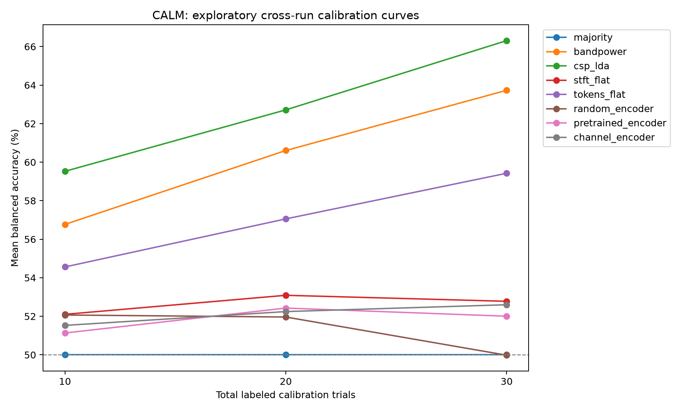

# Calibration-Light Motor BCI

Tests whether masked-reconstruction pretraining reduces calibration needs for subject-specific cross-run EEG motor-imagery decoding on PhysioNet.

This project compares a small masked
autoencoder with classical EEG classifiers on the public PhysioNet EEG Motor
Movement/Imagery Dataset.
In these experiments, the pretrained models did not reduce calibration needs.
CSP–LDA performed best, and a linear classifier on the pooled input features
outperformed the frozen pretrained embeddings.

## Results

Mean balanced accuracy across 15 evaluation subjects. Each run is tested using
calibration trials from the same person's other two runs. Logistic regression
probes use StandardScaler fitted on the selected calibration trials.

| Method | 5 trials/class | 10 trials/class | All 30 trials |
|---|---:|---:|---:|
| Majority | 50.00% | 50.00% | 50.00% |
| Bandpower + logistic regression | 56.77% | 60.61% | 63.73% |
| CSP–LDA | **59.53%** | **62.71%** | **66.31%** |
| Flattened log-STFT | 52.10% | 53.09% | 52.78% |
| Flattened MAE-input tokens | 54.56% | 57.06% | 59.42% |
| Random frozen encoder | 52.07% | 51.96% | 49.98% |
| Random-mask pretrained encoder | 51.13% | 52.43% | 52.00% |
| Channel-mask pretrained encoder | 51.53% | 52.24% | 52.60% |



Standardizing the pretrained probe changed full-data accuracy from 52.20% to
52.00%. Probing the pooled input tokens directly reached 59.42%, a paired gain
of 7.42 percentage points over the pretrained embedding (95% subject-bootstrap
CI: 1.23 to 13.69). The frozen encoder and mean pooling appear to be a bottleneck
for this linear readout; this comparison does not identify which component is
responsible.

[Result tables](reports/calibration_v1/) · [Experiment details and paired intervals](docs/calibration.md)

## Experiment setup

- **Data:** subjects 1–60, runs 4, 8, and 12; left/right motor imagery only.
- **Split:** subjects 1–36 for pretraining, 37–45 for preprocessing selection,
  and 46–60 for evaluation.
- **Preprocessing:** the selected setting uses the original reference, a
  4–40 Hz offline bandpass, and 0–4 second cue-aligned epochs.
- **Representation:** log-STFT power pooled into 64 channels × 2 bands
  (mu/beta) × 4 time bins. The transformer reconstructs hidden tokens using
  random-token or whole-channel masks. Its frozen outputs are mean-pooled.
- **Calibration:** 5/class, 10/class, or all available trials from two runs.
  All methods use identical sampled examples across 10 selection seeds.
  The smaller samples are nested inside the larger ones. The full-data
  condition is evaluated once per rotation.
- **Statistics:** average seeds within rotations, then rotations within subjects.
  Confidence intervals resample subjects, not individual folds or seeds.

## Limitations

This is an exploratory follow-up on subjects whose earlier results had already
been inspected. It measures cross-run decoding after subject-specific calibration,
not zero-shot transfer or generalization across recording sessions.

Each masking strategy uses one saved pretrained model. Sampling seeds do not
measure pretraining variability. Probe regularization is fixed at C=1, and
paired intervals are not adjusted for multiple comparisons. The original
pretraining code does not fully seed PyTorch, so retraining will not reproduce
identical checkpoint weights.

Visual cues correspond to the class labels, so above-chance decoding does not
establish that the models use motor activity alone. The delayed-window candidate
also includes some post-task rest. The older five-subject dropout pilot is
separate from these results and does not establish missing-electrode robustness.
There is no clinical or online BCI validation.

## Running the project

Requires Python 3.11+ and [uv](https://docs.astral.sh/uv/).

```bash
uv sync --extra dev

# Start with a small data check.
uv run calm download --subjects 1 2 3 4 5 --runs 4 8 12
uv run calm audit --subjects 1 2 3 4 5 --runs 4 8 12
uv run calm explore --subject 1
uv run calm baseline --subjects 1 2 3 4 5 --runs 4 8 12
```

To run the larger experiment, audit all 60 subjects first:

```bash
uv run calm audit --subjects $(seq 1 60)
uv run calm select-preprocessing
uv run calm pretrain --train-epochs 20
uv run calm pretrain --train-epochs 20 --mask-strategy whole_channel --checkpoint artifacts/checkpoints/mae_channel.pt
uv run calm evaluate-held-out
uv run calm calibration --config configs/calibration.yaml
```

These commands download the requested recordings if they are absent. Raw EEG
and checkpoints stay local. The calibration command checks checkpoint/data
compatibility and writes metrics, predictions, sample IDs, and provenance to
`artifacts/results/calibration_v1/`. It refuses to overwrite that directory;
use `--output-dir artifacts/results/calibration_repeat` for another run.
Other experiment commands can overwrite their default outputs.

The checked-in tables describe the original saved checkpoints. New pretraining
runs may give different results. Full reproduction settings and output files
are described in [the experiment notes](docs/calibration.md).

## Code layout

```text
src/calm/
  data/, audit/            Downloads, annotation mapping, recording checks
  signal/, features/       Filtering, epochs, bandpower
  models/, eval/           Classical classifiers and cross-run metrics
  representation/, mae/    Spectral tokens, masked pretraining, frozen probes
  robustness/, viz/        Corruption utilities and exploratory plots
  calibration.py          Shared trial sampling and calibration comparisons
  cli.py                  Command-line interface
configs/                  Experiment settings
tests/                    Synthetic EEG tests; no downloads required
reports/                  Selected experiment results
docs/                     Experiment notes
```

```bash
uv run pytest
uv run ruff check .
```

## Data and references

- [PhysioNet EEG Motor Movement/Imagery Dataset](https://physionet.org/content/eegmmidb/1.0.0/),
  Schalk (2009), DOI: 10.13026/C28G6P.
- [BCI2000: A General-Purpose Brain-Computer Interface System](https://doi.org/10.1109/TBME.2004.827072),
  Schalk et al. (2004).
- [MNE EEGBCI dataset loader](https://mne.tools/stable/generated/mne.datasets.eegbci.load_data.html).
